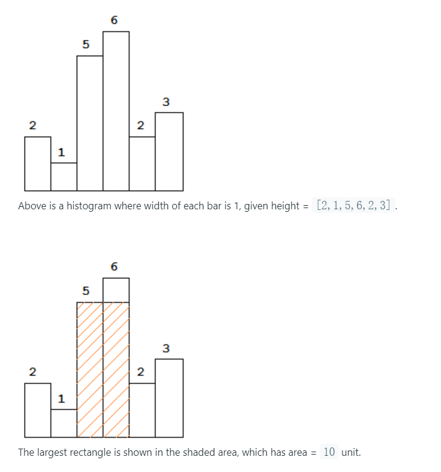

# Question
Given n non-negative integers representing the histogram's bar height where the width of each bar is 1, find the area of largest rectangle in the histogram.



**Example:**

    Input: [2,1,5,6,2,3]
    Output: 10

# 想法

* 自己的想法，遍历高度数组，对于每一个高度，往数组左边找到第一个比该高度小的，往数组右边也找第一个比该高度小的，这区间的所有长度作为宽，计算矩形的面积。遍历过程中最大的面积即为所求。然而，，，TLE

* 评论区一个大佬用的栈的思想，建立一个高度非降栈序列索引，若碰到某个高度低于栈顶索引对应高度，则在栈中往前依次计算以栈顶索引对应的高度为高，i - stack[-1] - 1 为宽的矩形面积，且栈顶元素出栈。这种情况下只需要O(n)复杂度。

    ```python
    class Solution:
        def largestRectangleArea(self, heights: List[int]) -> int:
            res = 0
            heights.append(0)
            stack = [-1]
            for i in range(len(heights)):
                while heights[i] < heights[stack[-1]]:
                    h = heights[stack.pop()]
                    w = i - stack[-1] - 1
                    res = max(res, h * w)
                stack.append(i)
            return res
    ```